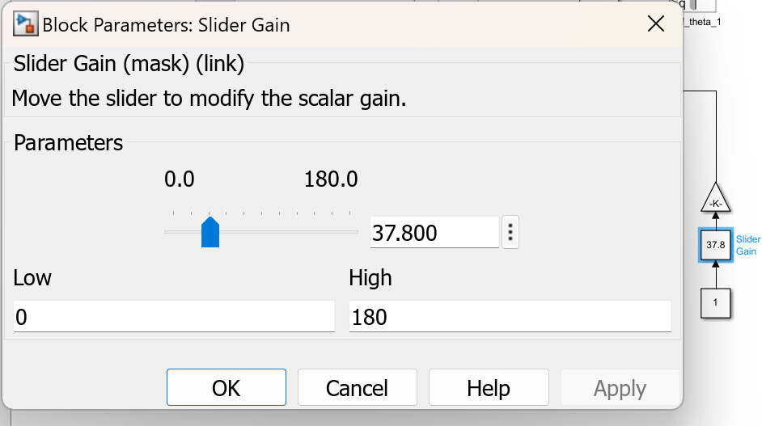

# Simscape Robot Arm Control Project

 

The model is structured as a **Rigid Body Tree**, which is subsequently transformed into a Simscape model. The Simscape model allows control over the arm's actuation through motion and torque inputs.

### **Actuation Control**:
   - Control the motion and torque of the arm's joints.

### **Control System Design**:
   - **Low-Level Control**: Adjust motion inputs directly using sliders.
   - **High-Level Control**: Implement a PID controller to manage motion and torque inputs.

#### Low-Level Control (Motion Control)
- Use the slider blocks in Simulink to adjust the motion of individual joints.

#### High-Level Control (PID Control)
- Use the provided PID controller block to control both motion and torque.
- Adjust the PID parameters to optimize performance.

## Future Work
- Extend the control system to support trajectory planning.
- Integrate ROS for real-time control and feedback.

