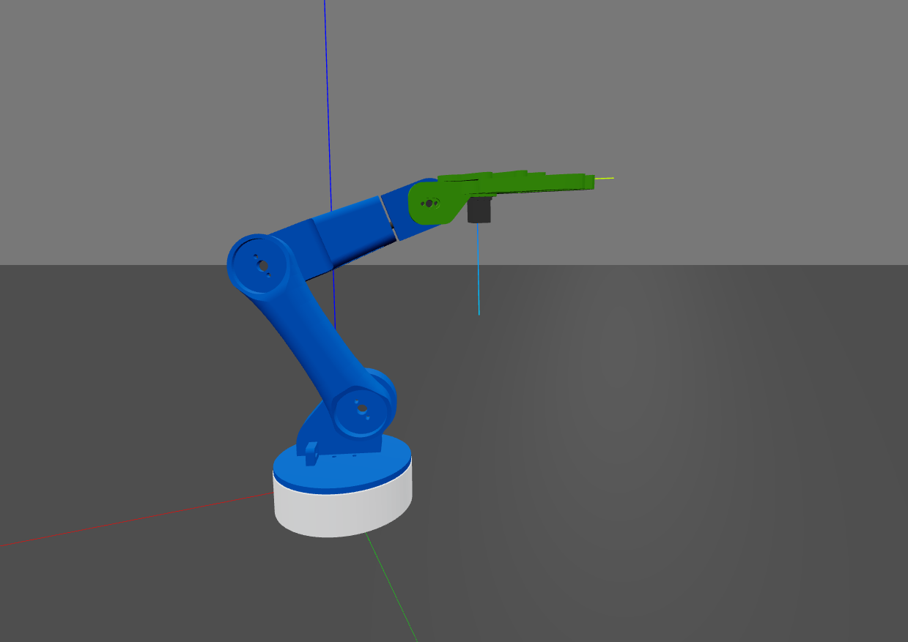
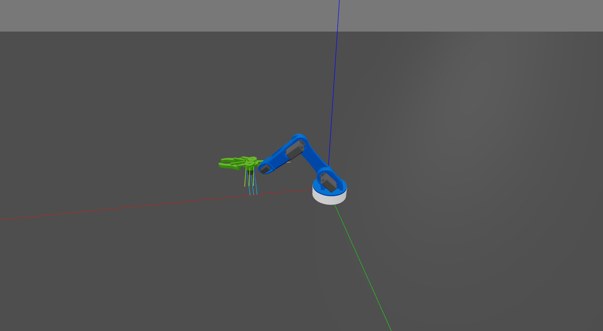

### **Documentation Overview**

This code combines simulation, kinematics, and control to visualize the motion of a robot arm.

#### **Libraries and Tools**
- roboticstoolbox: Used for modeling and controlling robots.
- swift: Provides a 3D visualization interface for robotics simulation.
- spatialmath: Handles transformations like rotations and translations.
- spatialgeometry: Adds geometric primitives for visualization.

#### **Functions**
- move_to_position:
Moves the robot's end-effector to a target position using servoing.
Computes joint velocities using the Jacobian and pseudoinverse.

#### **Execution**
Sequential movements along the x, y, and z axes demonstrate the robot’s capability.

 

 



#### **Details**:
##### **Servoing**:
Servoing is a feedback-based control technique that continuously adjusts the robot's motion to minimize the error between the current position (or pose) and the desired target position (or pose).
The function rtb.p_servo is used for position-based servoing.
- It calculates a velocity command v for the end-effector, based on the error between:
    
    - The current pose of the end-effector (from robot.fkine(robot.q)).
    
    - The target pose (Tep).
    
 - The gain parameter scales how aggressively the robot corrects the error.
 - The threshold parameter (set to 0.01) defines how close the end-effector must get to the target pose to consider the movement complete.

=> Servoing ensures that the end-effector dynamically adjusts its motion to precisely reach the target position.

##### **Jacobian Matrix (J)**
Maps joint velocities (`qd`) to end-effector velocity (`v`):
```
v = J * qd
```
##### **Pseudoinverse of Jacobian**
For non-square `J`, use the pseudoinverse (`J⁺`) to calculate `qd`:
```
qd = J⁺ * v
```
##### **In Code**
- `robot.jacobe(robot.q)`: Compute `J`.
- `np.linalg.pinv(J)`: Compute `J⁺`.
- `robot.qd = np.linalg.pinv(J) @ v`: Calculate `qd` for the desired `v`.


### Dependencies
Ensure the following libraries are installed in your Python environment:
```
roboticstoolbox
swift
numpy 
spatialmath
spatialgeometry
```
### Note
1- Update the paths in the URDF file to match your local system. For example:
```
<mesh filename="/Users/OUSSAMA/Desktop/projects/WIP/Arm robot project/5- simulation/robotics_tool_box_python/arm_robot/arm_01.stl"/>
```
2- Update the path in python coode:
```
robot = rtb.Robot.URDF("/Users/OUSSAMA/Desktop/projects/WIP/Arm robot project/5- simulation/robotics_tool_box_python/arm_robot/robot.urdf")
```